# PoolMind - Pooled Crypto Arbitrage Fund Platform

[](https://nodejs.org/)
[](https://www.typescriptlang.org/)
[](https://www.stacks.co/)
[](https://www.mongodb.com/)
[](https://redis.io/)

PoolMind is a comprehensive full-stack platform built on the Stacks blockchain for managing a pooled crypto arbitrage fund. The system enables multiple users to contribute capital to a shared trading pool managed by AI agents, with profits distributed transparently through blockchain-based smart contracts.

## 🏗️ System Architecture

PoolMind consists of three primary components working together to provide a secure, scalable, and user-friendly arbitrage trading platform:

### Core Components

1. **Smart Contract Layer** - Clarity-based contracts on Stacks blockchain
2. **Orchestrator API** - Node.js/Express backend with comprehensive services
3. **Telegram Bot** - User interface and notification system
4. **React Frontend** - Web interface for wallet connection and pool operations

## 📊 Software Architecture Diagram

```mermaid
graph TB
    %% Users
    User[👤 Users]
    TelegramUser[📱 Telegram Users]
    WebUser[🌐 Web Users]
    
    %% External Services
    StacksBlockchain[🔗 Stacks Blockchain]
    MongoDB[(🗄️ MongoDB)]
    Redis[(🔴 Redis)]
    
    %% Frontend Layer
    TelegramBot[📱 Telegram Bot<br/>TypeScript + Telegraf]
    ReactFrontend[⚛️ React Frontend<br/>TypeScript + Vite]
    
    %% API Layer
    OrchestratorAPI[🎯 Orchestrator API<br/>Node.js + Express + TypeScript]
    
    %% Services Layer
    AuthService[🔐 Authentication Service]
    ContractService[📜 Smart Contract Service]
    NotificationService[🔔 Notification Service]
    QueueService[⚙️ Queue Service]
    TransactionService[💳 Transaction Service]
    UserService[👤 User Service]
    
    %% Smart Contract Layer
    PoolMindContract[📋 PoolMind Smart Contract<br/>Clarity Language]
    PLMDToken[🪙 PLMD Token<br/>SIP-010 Fungible Token]
    
    %% Data Layer
    UserData[👥 User Data]
    TransactionData[💸 Transaction Data]
    NotificationData[📢 Notification Data]
    
    %% User Interactions
    User --> TelegramUser
    User --> WebUser
    
    TelegramUser --> TelegramBot
    WebUser --> ReactFrontend
    
    %% Frontend to API
    TelegramBot --> OrchestratorAPI
    ReactFrontend --> OrchestratorAPI
    
    %% API to Services
    OrchestratorAPI --> AuthService
    OrchestratorAPI --> ContractService
    OrchestratorAPI --> NotificationService
    OrchestratorAPI --> QueueService
    OrchestratorAPI --> TransactionService
    OrchestratorAPI --> UserService
    
    %% Services to External
    ContractService --> StacksBlockchain
    AuthService --> MongoDB
    UserService --> MongoDB
    TransactionService --> MongoDB
    NotificationService --> Redis
    QueueService --> Redis
    
    %% Smart Contract Layer
    StacksBlockchain --> PoolMindContract
    PoolMindContract --> PLMDToken
    
    %% Data Storage
    MongoDB --> UserData
    MongoDB --> TransactionData
    Redis --> NotificationData
    
    %% Notification Flow
    NotificationService -.-> TelegramBot
    
    %% Background Processing
    QueueService -.-> TransactionService
    
    %% Styling
    classDef frontend fill:#e1f5fe,stroke:#01579b,stroke-width:2px
    classDef backend fill:#f3e5f5,stroke:#4a148c,stroke-width:2px
    classDef blockchain fill:#fff3e0,stroke:#e65100,stroke-width:2px
    classDef database fill:#e8f5e8,stroke:#1b5e20,stroke-width:2px
    classDef service fill:#fce4ec,stroke:#880e4f,stroke-width:2px
    
    class TelegramBot,ReactFrontend frontend
    class OrchestratorAPI backend
    class StacksBlockchain,PoolMindContract,PLMDToken blockchain
    class MongoDB,Redis,UserData,TransactionData,NotificationData database
    class AuthService,ContractService,NotificationService,QueueService,TransactionService,UserService service
```



## 🔧 Component Details

### 1. PoolMind Smart Contract (Clarity)

**Location**: `contracts/`

A SIP-010 compliant smart contract that manages the pooled arbitrage fund on the Stacks blockchain.

**Key Features**:
- **Deposit/Withdrawal**: Users deposit STX and receive PLMD tokens representing their fund share
- **NAV Management**: Admin-controlled Net Asset Value updates to reflect trading performance
- **Fee System**: Configurable entry (0.5%) and exit (0.5%) fees
- **Admin Controls**: Emergency pause, token transfer controls, STX management
- **Historical Tracking**: NAV history with event emissions for transparency

**Core Functions**:
```clarity
;; User Functions
(deposit (amount-stx uint))           ;; Deposit STX, receive PLMD tokens
(withdraw (amount-shares uint))       ;; Burn PLMD tokens, receive STX

;; Admin Functions
(update-nav (new-nav uint))          ;; Update fund NAV
(withdraw-to-admin (amount uint))    ;; Move STX for trading
(admin-deposit (amount-stx uint))    ;; Return trading profits

;; Read-Only Functions
(get-nav)                            ;; Current NAV
(get-balance (owner principal))      ;; PLMD token balance
(get-contract-state)                 ;; Complete contract state
```

**Token Economics**:
- **PLMD Token**: 6 decimal precision (1 PLMD = 1,000,000 microPLMD)
- **NAV Calculation**: Tokens minted = (STX deposit - fees) × precision / NAV
- **Withdrawal**: STX received = (PLMD burned × NAV / precision) - exit fees

### 2. Orchestrator API (Node.js/Express/TypeScript)

**Location**: `orchestrator/`

The central backend service providing comprehensive platform functionality.

**Architecture**:
```
orchestrator/
├── src/
│   ├── config/           # Environment and configuration
│   ├── controllers/      # HTTP request handlers
│   ├── middleware/       # Auth, validation, HMAC
│   ├── models/          # MongoDB schemas
│   ├── routes/          # API route definitions
│   ├── services/        # Business logic layer
│   ├── utils/           # Utilities and helpers
│   ├── docs/            # API documentation
│   └── frontend/        # React frontend
└── docker-compose.yml   # Container orchestration
```

**Key Services**:

#### Authentication Service
- **Telegram Web App Integration**: JWT-based authentication
- **Wallet Linking**: Secure Stacks wallet association
- **Session Management**: User session and token handling

#### Smart Contract Service
- **Contract Interactions**: Deposit, withdrawal, admin operations
- **Read Operations**: Balance queries, NAV retrieval, contract state
- **Transaction Broadcasting**: Stacks network integration

#### Notification Service
- **Redis Pub/Sub**: Real-time event publishing
- **Event Types**: Wallet linking, deposits, withdrawals, transaction status
- **External Integration**: Telegram bot notification delivery

#### Queue Service
- **Background Processing**: Transaction polling and monitoring
- **Bull Queue Integration**: Redis-backed job processing
- **Retry Logic**: Configurable retry mechanisms for failed operations

#### Transaction Service
- **Status Polling**: Automatic transaction confirmation monitoring
- **Database Integration**: Transaction state persistence
- **Timeout Handling**: Automatic cleanup of stalled transactions

**API Endpoints**:
```
/api/v1/auth/*           # Authentication & user management
/api/v1/pool/*           # Pool operations & state
/api/v1/transactions/*   # Transaction management
/api/v1/balances/*       # User balance queries
/api/v1/fund-request/*   # HMAC-secured fund requests
/api-docs                # Swagger documentation
```

**Security Features**:
- **JWT Authentication**: Secure token-based authentication
- **HMAC Signatures**: Fund request API protection
- **Rate Limiting**: API abuse prevention
- **Input Validation**: Zod schema validation
- **CORS Configuration**: Cross-origin request handling

### 3. Telegram Bot (TypeScript/Telegraf)

**Location**: `telegram-app/`

A comprehensive Telegram interface providing user-friendly access to the platform.

**Architecture**:
```
telegram-app/
├── src/
│   ├── bot/
│   │   ├── commands/     # Bot command handlers
│   │   ├── callbacks/    # Callback query handlers
│   │   ├── keyboards/    # Interactive keyboards
│   │   └── middleware/   # Session, auth, rate limiting
│   ├── services/         # External service integrations
│   ├── config/          # Bot configuration
│   └── utils/           # Utilities and helpers
```

**Key Features**:

#### User Management
- **Authentication**: Seamless Telegram user authentication
- **Profile Management**: User profile and preferences
- **Wallet Integration**: Guided wallet connection process

#### Interactive Commands
```
/start                   # Welcome and registration
/profile                 # User profile and wallet status
/help                    # Command documentation
```

#### Notification System
- **Real-time Alerts**: Transaction confirmations, wallet events
- **Subscription Management**: Notification preferences
- **Event Handling**: Deposit success, withdrawal completion

#### Session Management
- **Redis Storage**: Persistent user sessions
- **State Tracking**: Conversation state and user data
- **Cleanup**: Automatic session expiration

### 4. React Frontend (TypeScript/Vite)

**Location**: `orchestrator/src/frontend/`

A modern web interface for wallet connection and pool operations.

**Architecture**:
```
frontend/
├── src/
│   ├── components/       # React components
│   ├── utils/           # API clients, contract interactions
│   ├── types/           # TypeScript definitions
│   └── config/          # Frontend configuration
```

**Key Components**:

#### Wallet Connection
- **Stacks Connect Integration**: Native wallet connection
- **Mobile Support**: Deep linking for mobile wallets
- **Multi-wallet Support**: Xverse, Leather, Hiro wallets

#### Pool Operations
- **Deposit Interface**: STX deposit with PLMD calculation
- **Withdrawal Interface**: PLMD burning with STX calculation
- **Real-time Updates**: Live balance and pool state

#### User Interface
- **Responsive Design**: Mobile-first approach
- **Modern Styling**: Tailwind CSS with gradient themes
- **Error Handling**: Comprehensive error states and messaging

## 🔄 Data Flow & Communication

### 1. User Deposit Flow
```
User → Frontend/Bot → API → Smart Contract → Blockchain
                    ↓
Queue Service → Transaction Polling → Status Updates
                    ↓
Notification Service → Redis Pub/Sub → Telegram Bot
```

### 2. Authentication Flow
```
Telegram User → Bot → API Authentication → JWT Token
                             ↓
                    Session Storage → Future API Calls
```

### 3. Notification Flow
```
Smart Contract Event → Transaction Polling → Database Update
                                          ↓
                    Notification Service → Redis Channel
                                          ↓
                    Telegram Bot → User Notification
```

## 🛠️ Technology Stack

### Backend Technologies
- **Runtime**: Node.js 20.19+
- **Framework**: Express.js with TypeScript
- **Database**: MongoDB with Mongoose ODM
- **Cache/Queue**: Redis with Bull queue processing
- **Blockchain**: Stacks.js SDK for blockchain interactions
- **Authentication**: JWT tokens with Telegram integration

### Frontend Technologies
- **Framework**: React 19+ with TypeScript
- **Build Tool**: Vite for fast development and building
- **Styling**: Tailwind CSS for responsive design
- **Wallet**: Stacks Connect for wallet integration
- **Routing**: React Router for client-side navigation

### Smart Contract
- **Language**: Clarity for Stacks blockchain
- **Standard**: SIP-010 fungible token implementation
- **Testing**: Clarinet with TypeScript test framework
- **Network**: Supports mainnet, testnet, and devnet

### DevOps & Deployment
- **Containerization**: Docker with multi-stage builds
- **Orchestration**: Docker Compose for service management
- **Environment**: Configurable for development/production
- **Monitoring**: Winston logging with file rotation

## 🚀 Getting Started

### Prerequisites
- Node.js 20.19+
- MongoDB instance
- Redis instance
- Telegram Bot Token
- Stacks wallet for testing

### Quick Setup

1. **Clone the repository**
```bash
git clone <repository-url>
cd poolmind
```

2. **Smart Contract Setup**
```bash
cd contracts
npm install
npm run test                    # Run contract tests
clarinet console               # Interactive contract testing
```

3. **Orchestrator API Setup**
```bash
cd orchestrator
npm install
cp .env.example .env           # Configure environment variables
npm run build:all              # Build frontend and backend
npm run dev                    # Start development server
```

4. **Telegram Bot Setup**
```bash
cd telegram-app
npm install
cp env.example .env            # Configure bot token and API URL
npm run dev                    # Start bot in development mode
```

### Environment Configuration

**Orchestrator API** (`.env`):
```env
# Server Configuration
NODE_ENV=development
PORT=3000
APP_URL=http://localhost:3000

# Database
MONGODB_URI=mongodb://localhost:27017/poolmind
REDIS_URL=redis://localhost:6379

# Authentication
JWT_SECRET=your-super-secret-jwt-key
TELEGRAM_BOT_TOKEN=your-telegram-bot-token

# Stacks Network
STACKS_NETWORK=devnet
POOLMIND_CONTRACT_ADDRESS=your-contract-address
POOLMIND_CONTRACT_NAME=poolmind
POOLMIND_ADMIN_PRIVATE_KEY=your-admin-private-key

# Security
HMAC_SECRET=your-hmac-secret-for-fund-requests
```

**Telegram Bot** (`.env`):
```env
# Bot Configuration
BOT_TOKEN=your-telegram-bot-token
API_BASE_URL=http://localhost:3000/api/v1
REDIS_URL=redis://localhost:6379

# Security
JWT_SECRET=your-jwt-secret
ENCRYPTION_KEY=your-encryption-key
```

### Docker Deployment

```bash
# Build and start all services
docker-compose up -d

# View logs
docker-compose logs -f

# Stop services
docker-compose down
```

## 📚 API Documentation

The Orchestrator API includes comprehensive Swagger documentation available at:
- Development: `http://localhost:3000/api-docs`
- Production: `https://poolmind.futurdevs.com/api-docs`

### Key API Endpoints

#### Authentication
```http
POST /api/v1/auth/telegram      # Telegram authentication
GET  /api/v1/auth/profile       # Get user profile
POST /api/v1/auth/wallet        # Link wallet address
```

#### Pool Operations
```http
GET  /api/v1/pool/state         # Get pool state and NAV
POST /api/v1/pool/deposit       # Submit deposit transaction
POST /api/v1/pool/withdraw      # Submit withdrawal transaction
```

#### Transaction Management
```http
POST /api/v1/transactions/submit    # Submit transaction for monitoring
GET  /api/v1/transactions/:txId     # Get transaction status
```

#### Fund Requests (HMAC Protected)
```http
POST /api/v1/fund-request       # Request STX funds (trading bots)
GET  /api/v1/fund-request/balance   # Check available balance
```

## 🔐 Security Features

### Smart Contract Security
- **Access Controls**: Admin-only functions with proper authorization
- **Pause Mechanism**: Emergency halt for deposits/withdrawals
- **Balance Validation**: Comprehensive balance checks before operations
- **Transfer Controls**: Optional token transfer restrictions

### API Security
- **JWT Authentication**: Secure token-based authentication
- **HMAC Signatures**: Fund request API protection with replay attack prevention
- **Rate Limiting**: Configurable request rate limiting
- **Input Validation**: Comprehensive request validation with Zod schemas
- **CORS Protection**: Configurable cross-origin request handling

### Infrastructure Security
- **Environment Isolation**: Separate configurations for dev/staging/production
- **Secret Management**: Secure handling of private keys and tokens
- **Database Security**: MongoDB connection with authentication
- **Redis Security**: Secure Redis connections with authentication

## 📊 Monitoring & Observability

### Logging
- **Structured Logging**: Winston with JSON format
- **Log Levels**: Configurable log levels (error, warn, info, debug)
- **File Rotation**: Automatic log file rotation and archival
- **Service Separation**: Separate logs for different services

### Health Checks
```http
GET /health                     # API health check
```

### Queue Monitoring
- **Job Status**: Monitor queue job success/failure rates
- **Performance Metrics**: Track processing times and throughput
- **Error Tracking**: Comprehensive error logging and alerting

### Notification System
- **Event Tracking**: Monitor notification delivery success rates
- **Redis Monitoring**: Track pub/sub channel health
- **User Engagement**: Monitor notification preferences and responses

## 🧪 Testing

### Smart Contract Testing
```bash
cd contracts
npm run test                    # Run comprehensive test suite
clarinet check                 # Static analysis
```

### API Testing
```bash
cd orchestrator
npm test                        # Unit and integration tests
npm run lint                    # Code quality checks
```

### Bot Testing
```bash
cd telegram-app
npm test                        # Bot functionality tests
npm run lint                    # Code quality checks
```

## 📈 Performance Considerations

### Database Optimization
- **Indexing**: Optimized MongoDB indexes for user queries
- **Connection Pooling**: Efficient database connection management
- **Query Optimization**: Optimized queries for balance and transaction lookups

### Caching Strategy
- **Redis Caching**: Session data and frequently accessed information
- **Queue Processing**: Efficient background job processing
- **API Response Caching**: Strategic caching of expensive operations

### Blockchain Interactions
- **Connection Pooling**: Efficient Stacks API connections
- **Retry Logic**: Robust retry mechanisms for network issues
- **Transaction Batching**: Efficient transaction submission and monitoring

## 🙏 Acknowledgments

- **Stacks Foundation** for the blockchain infrastructure
- **Hiro Systems** for the development tools and SDKs
- **Telegram** for the Bot API platform
- **Open Source Community** for the excellent libraries and frameworks

## 📞 Support

- **Documentation**: [API Docs](https://poolmind.futurdevs.com/api-docs)
- **Issues**: [GitHub Issues](https://github.com/Mcsavvy/poolmind/issues)
- **Email**: support@futurdevs.com
- **Telegram**: @Mcsavvy

---

**PoolMind** - Democratizing access to sophisticated arbitrage trading through blockchain technology and AI-powered automation. 